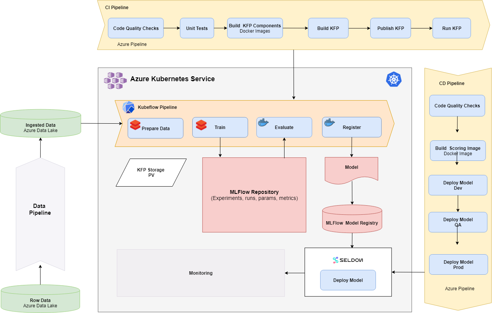

# KubeMLOps

## Overview

The repository contains a sample created from the Kubeflow [End-to-End Pipeline Example on Azure](https://www.kubeflow.org/docs/azure/azureendtoend/). It builds a Kubeflow pipeline(KFP) with both GitHub actions and Azure DevOps that trains a Tensorflow model recognizing tacos and burritos images. The model is registered in MLFlow. Kubeflow is running on Azure Kubernetes Service(AKS). The structure of this sample should make it easier to “bring your own code” and adopt the template for a real-life machine learning(ML) project.

The architecture of the sample is shown in the following diagram:

- The KFP contains the following steps:
  - Data preprocessing
  - Training
  - Registering
  - Deploying
- The model is registered and deployed in AML WS (working on MLFlow model registration also)
- The Continuous Integration(CI) pipeline is implemented with GitHub Actions, it is being triggered on PR, master merge, ChatOps comments (e.g. /build-images, /build-pipeline) and it has the following steps:
  - Linting
  - Builds Docker images – KFP components/steps
  - Publishes the KFP as an artifact
  - Uploads the pipeline to Kubeflow
  - Runs the KFP

For this sample, DataOps for ML and Observability are currently out of scope. 

## Prerequisites

Before you get started, make sure you have the following prerequisites:

- An Azure Kubernetes Service cluster
- Ensure the [latest](https://docs.microsoft.com/en-us/cli/azure/install-azure-cli?view=azure-cli-latest) version of Azure CLI is installed.
- Clone or fork the repository

This documentation helps you get started with the sample from infrastructure setup to deployment of the model.

## Setup

- [Kubeflow Installation on AKS](./docs/Kubeflow-install.md)
- [Securing Kubeflow on AKS](./docs/Kubeflow-secure.md)
- MLOps with GitHub
  - [CI/Pull Request](./docs/ci-pullrequest.md)
  - [CI/Training](./docs/ci-training.md)
  - [CD/Seldon](./docs/cd-seldon.md)

Code for the following can be found in the code directory, but currently there is no documentation:

- MLOps with Azure DevOps
- Experiment Tracking
- Running Kubeflow component in parallel
- Running Jupyter Server within Kubeflow
- Running MLFlow Project from Kubeflow
- Model deployment with KF Serving
