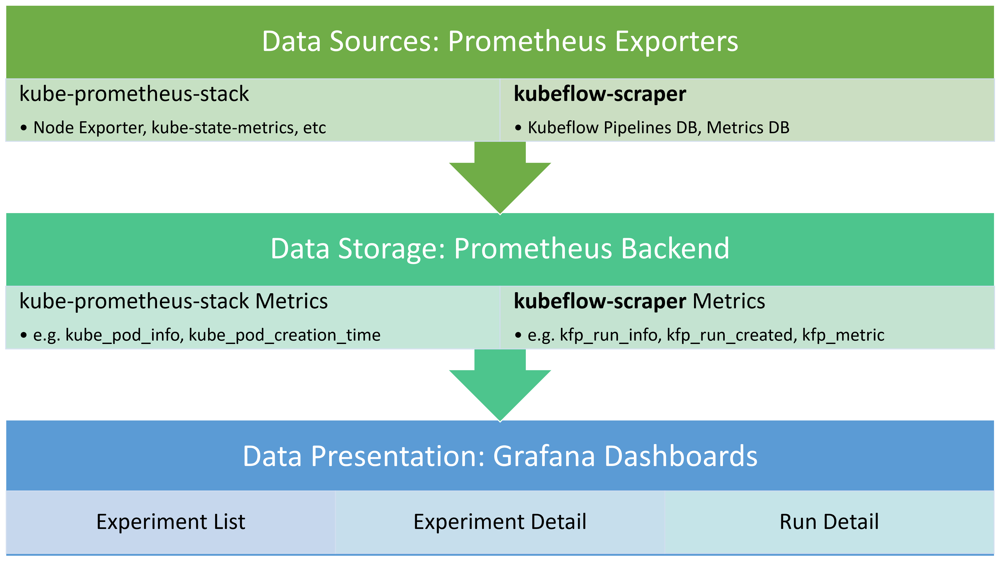

# Kubeflow Scraper and Dashboards

## Overview

This folder contains a scraping service for Kubeflow Pipelines and a set of monitoring dashboards that consume the scraped data. The solution provides a set of dashboards that give an overview of experiments and runs that are active in Kubeflow Pipelines, along with the resource usage of the cluster.



## Kubeflow Pipelines Scraper

The scraper consists of set of config files that export data in Prometheus exposition format. It leverages the [query-exporter](https://github.com/albertodonato/query-exporter) project to periodically query the Kubeflow MySQL database and provide a Prometheus endpoint.

We currently make the following queries and data available:

- Kubeflow Pipelines run data including experiment, run id, workload id, etc
- Metadata DB data that links Kubeflow Pipeline run workloads to pods and step descriptions (avoids JSON parsing)

With this data exposed, we have a way to link run data to pods and therefore Kubernetes stats. We also avoid numerous queries to the KubeFlow Pipelines API and Metadata DB gRPC API, and avoid the need to parse the workflow JSON.

## Dashboards

The dashboards are interlinked and are intended to be used to drill down into data as necessary.

### Kubeflow Experiment List

The Experiment List is the top level dashboard and provides an overview of the recent experiments, the success rate of their runs, and information on the nodes used by the runs. Experiments link to the Experiment Detail dashboard for the selected experiment.

[](images/kfp-experiment-list.png)

### Kubeflow Experiment Detail

The Experiment Detail dashboard provides an overview of the recent runs for the selected experiment, including the overall success rate, average duration, and resource usage specific to each run. Listed runs link to the Run Detail dashboard for that particular run. In addition, the dashboard shows the steps of the runs that used the most resources, and the cumulative resource usage per step. Model metrics for recent runs are also listed.

[](images/kfp-experiment-detail-1.png)

[](images/kfp-experiment-detail-2.png)

[](images/kfp-experiment-detail-3.png)

### Kubeflow Run Detail

The Run Detail dashboard is the most granular and shows the list of steps for the run and their resource usage. Also visible is a timeline of the steps and the CPU and memory usage of the individual pods used in each step.

[](images/kfp-experiment-detail-1.png)

[](images/kfp-experiment-detail-2.png)

## Install instructions

### 1. Install kube-prometheus-stack

The [kube-prometheus-stack Helm chart](https://github.com/prometheus-community/helm-charts/tree/main/charts/kube-prometheus-stack) (formally known as prometheus-operator) installs Prometheus, Grafana, and several exporters that give a base cluster monitoring solution that can be used as a base for the included dashboards. At the time of writing, this guide worked with the 10.1.1 version of the chart.

1. Create a 'monitoring' namespace to deploy the stack
   1. `kubectl create namespace monitoring`
1. Deploy the kube-prometheus-stack Helm chart
   1. [Customize the values of the chart](https://github.com/prometheus-community/helm-charts/tree/main/charts/kube-prometheus-stack#configuration) as needed and create a values.yaml with your customizations.
      1. Note: You will need persistent volume claims if you want to have the dashboards and data persist across pod restarts. As a simple example, you could create these for Prometheus and Grafana with the following overrides in values.yaml:

         ```yaml
         grafana:
            persistence:
               type: pvc
               enabled: true
               storageClassName: default
               accessModes:
                  - ReadWriteOnce
               size: 4Gi
               finalizers:
                  - kubernetes.io/pvc-protection
         prometheus:
            prometheusSpec:
               storageSpec:
                  volumeClaimTemplate:
                  spec:
                     storageClassName: default
                     accessModes: ["ReadWriteOnce"]
                     resources:
                        requests:
                        storage: 16Gi
         ```

      1. Deploy the chart with `helm install -n monitoring kube-prometheus-stack prometheus-community/kube-prometheus-stack --values values.yaml`

   1. If you are currently using seldon-core-analytics, redeploy it using the kube-prometheus-stack exporters so they don't step on each other
      1. `helm install seldon-core-analytics seldonio/seldon-core-analytics --namespace seldon-system --reuse-values --set prometheus.nodeExporter.enabled=false --set prometheus.kubeStateMetrics.enabled=false`

### 2. Install kubeflow-scraper

1. Create a read only user for scraping from Kubeflow Pipeline's MySQL DB. If you have a separate metadata db, you will need to do the same for that one.
   1. Open a connection to Kubeflow's MySQL DB e.g. `kubectl port-forward svc/mysql -n kubeflow 3306:3306`
   1. Create a user with SELECT privileges only e.g. 'kfpexporter' and note the password
1. Update query-pod.yml db connection secret with the MySQL creds you created
1. Deploy the config.yaml as a ConfigMap
   1. `kubectl create configmap -n kubeflow kfp-exporter-config --from-file config.yaml`
1. Deploy the service, app deployment, secret, and ServiceMonitor
   1. `kubectl apply -f query-pod.yml`
1. You should now see a kfp-exporter-* pod in your 'kubeflow' namespace. To check if there are errors, look at the pod logs.
   1. For example: `kubectl logs -n kubeflow kfp-exporter-0123456789-abcde`
   1. If the pod logs are still empty after a few minutes, everything should be working. If not, check for SQL error messages and double check your credentials.

### 3. Import dashboards into Grafana

1. Connect to Grafana
   1. `kubectl port-forward -n monitoring svc/kube-prometheus-stack-grafana 8080:80`
   1. Navigate to <http://localhost:8080> and login with the credentials you configured as part of setting up kube-prometheus-stack ([Customize the values of the chart](https://github.com/prometheus-community/helm-charts/tree/main/charts/kube-prometheus-stack#configuration))
1. Import the kubeflow-*.json dashboards in this directory. See the [Grafana docs](https://grafana.com/docs/grafana/latest/dashboards/export-import/#importing-a-dashboard) for more info on importing dashboards.
1. Start some Kubeflow Pipelines runs and after about 5-10mins you will start to see data in the dashboards.
