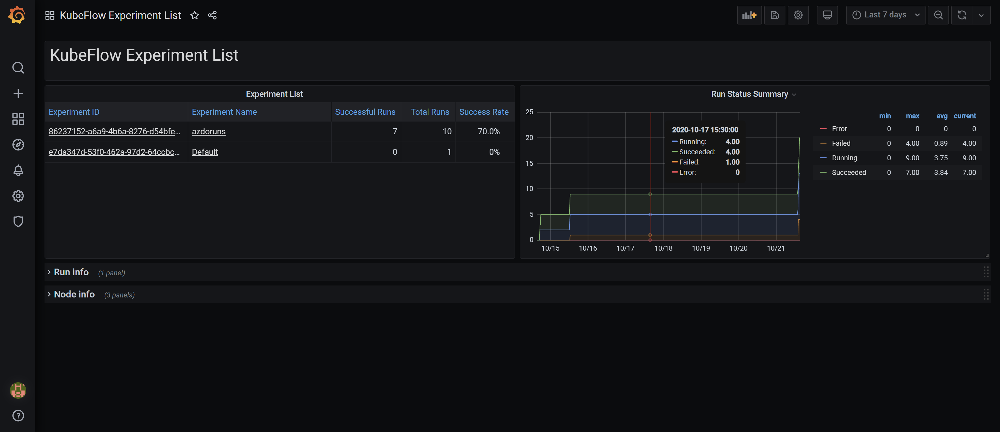
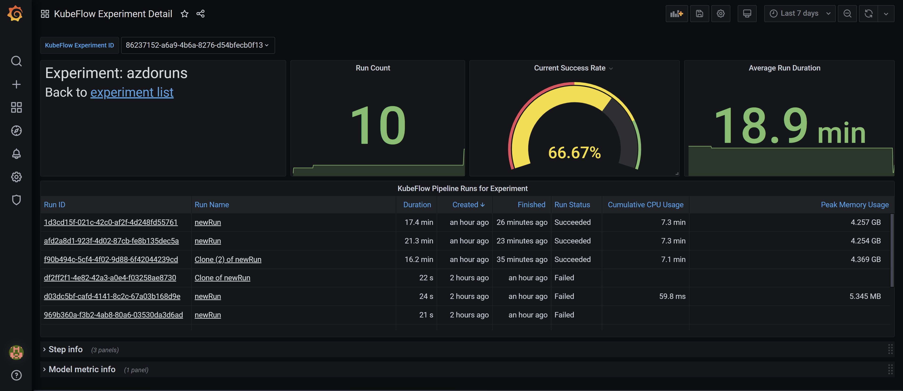
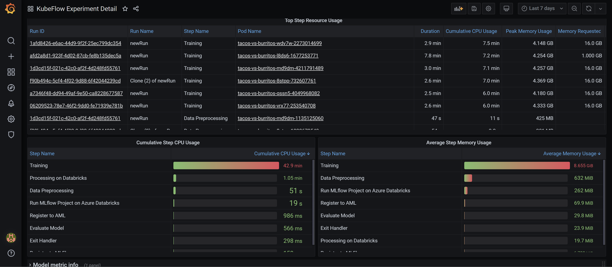
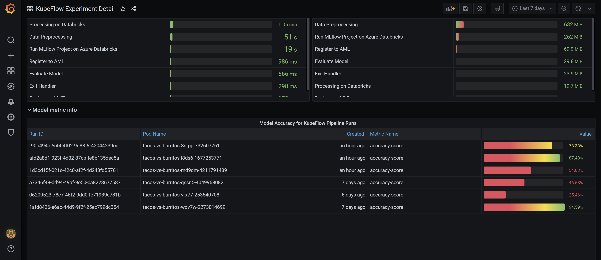
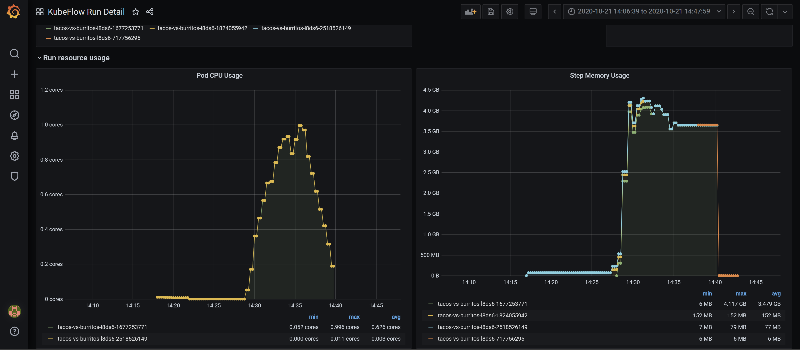

# Kubeflow Scraper and Dashboards

## Overview

This folder contains a scraping service for Kubeflow Pipelines and a set of monitoring dashboards that consume the scraped data. The solution provides a set of dashboards that give an overview of experiments and runs that are active in Kubeflow Pipelines, along with the resource usage of the cluster.

## Kubeflow Pipelines Scraper

The scraper consists of set of config files that export data in Prometheus exposition format. It leverages the [query-exporter](https://github.com/albertodonato/query-exporter) project to periodically query the Kubeflow MySQL database and provide a Prometheus endpoint.

We currently make the following queries and data available:

- Kubeflow Pipelines run data including experiment, run id, workload id, etc
- Metadata DB data that links Kubeflow Pipeline run workloads to pods and step descriptions (avoids JSON parsing)

With this data exposed, we have a way to link run data to pods and therefore Kubernetes stats. We also avoid numerous queries to the KubeFlow Pipelines API and Metadata DB gRPC API, and avoid the need to parse the workflow JSON.

## Dashboards

The dashboards are interlinked and are intended to be used to drill down into data as necessary.

### Kubeflow Experiment List

The Experiment List is the top level dashboard and provides an overview of the recent experiments, the success rate of their runs, and information on the nodes used by the runs. Experiments link to the Experiment Detail dashboard for the selected experiment.

### Kubeflow Experiment Detail

The Experiment Detail dashboard provides an overview of the recent runs for the selected experiment, including the overall success rate, average duration, and resource usage specific to each run. Listed runs link to the Run Detail dashboard for that particular run. In addition, the dashboard shows the steps of the runs that used the most resources, and the cumulative resource usage per step. Model metrics for recent runs are also listed.

### Kubeflow Run Detail

The Run Detail dashboard is the most granular and shows the list of steps for the run and their resource usage. Also visible is a timeline of the steps and the CPU and memory usage of the individual pods used in each step.

## Install instructions

1. Create 'monitoring' namespace
   1. `kubectl create namespace monitoring`
2. Deploy kube-prometheus-stack
   1. `helm install -n monitoring kube-prometheus-stack prometheus-community/kube-prometheus-stack`
3. If you are currently using seldon-core-analytics, redeploy using the kube-prometheus-stack exporters so they don't step on each other
   1. `helm install seldon-core-analytics seldonio/seldon-core-analytics --namespace seldon-system --set prometheus.nodeExporter.enabled=false --set prometheus.kubeStateMetrics.enabled=false`
4. Create a read only user for scraping from kfp's mysql. If you have a separate metadata db, you will need to do the same for that one.
   1. Open a connection to kubeflow's mysql `kubectl port-forward svc/mysql -n kubeflow 3306:3306`
   2. Create a user with SELECT privileges only e.g. 'kfpexporter' and note the password
5. Update query-pod.yml db connection secret with the db creds you created
6. Deploy the config.yaml as a configmap
   1. `kubectl create configmap -n kubeflow kfp-exporter-config --from-file config.yaml`
7. Deploy the service, app deployment, secret, and ServiceMonitor
   1. `kubectl apply -f query-pod.yml`
8. Connect to Grafana
   1. `kubectl port-forward -n monitoring svc/kube-prometheus-stack-grafana 8080:80`
9. Import the kubeflow-*.json dashboards in this directory. See the [Grafana docs](https://grafana.com/docs/grafana/latest/dashboards/export-import/#importing-a-dashboard) for more info on importing dashboards.
