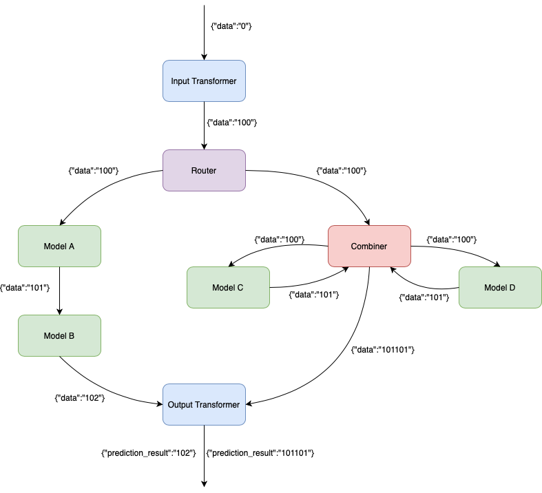

## Seldon Inference pipeline

This sample demonstrates a simple inference pipeline containing all component types of a Seldon predictor such as 
* Model
* Router
* Combiner
* Transformer
* Output_Transformer

The input data for the pipeline is a json with an integer payload. The Input Transformer component adds 100 to the payload and forwards the request to the Router. The Router component randomly routes the request to either Model A or to the Combiner. 
Every model emulates a prediction by incrementing a payload. For example, the prediction made by Model A for {"data":"100"} will be {"data":"101"}. Model B takes the prediction from Model A as an input and returns the prediction {"data":"102"}.
The Combiner component aggregates the results of its children, so it concatenates the predictions from Model C and Model D and returns {"data":"101101"}.
Th Output Transformer wraps the result into a json with "prediction_result" attribute.

All components are implemented in a single [pipeline.py](pipeline.py) and packaged in a single [Docker image](Dockerfile). The Seldon Deployment with the inference pipeline is defined in [pipeline.yaml](pipeline.yaml).

