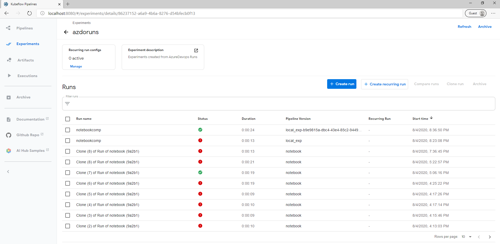
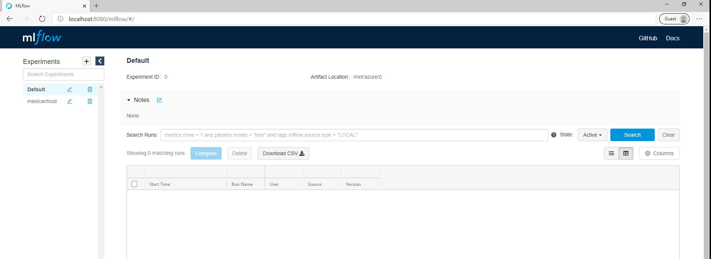
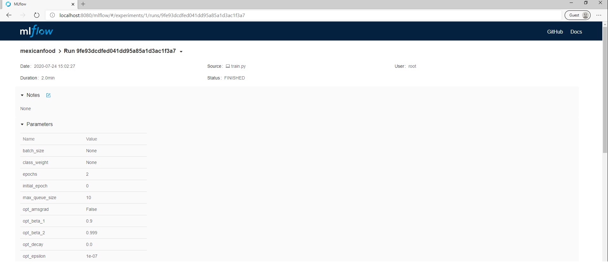
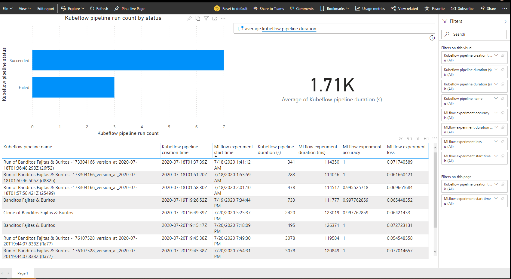
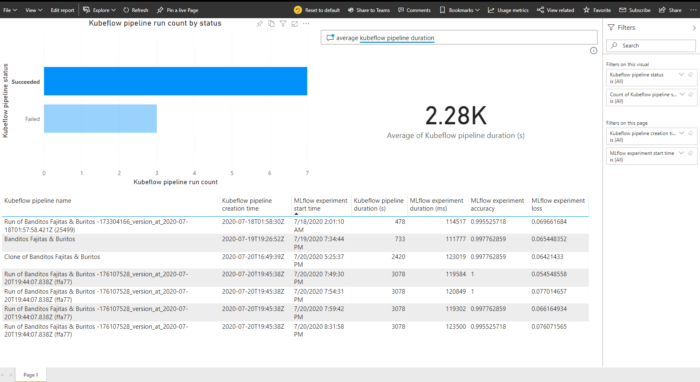
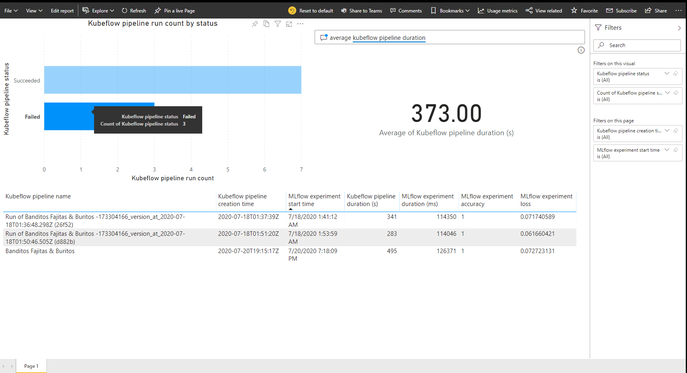
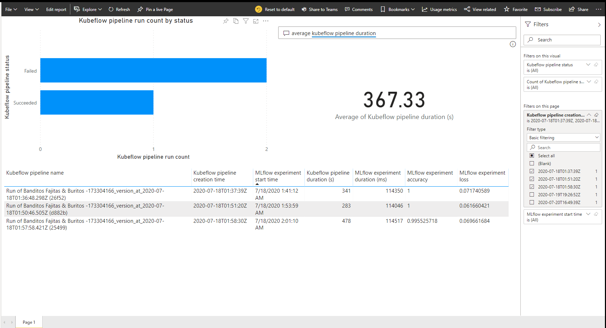

# Experiment Tracking

## Tracking pipelines with Kubeflow

### Access the Kubeflow dashboard

Go to http://{KUBEFLOW_HOST}/_/pipelines/

### Tracking pipeline artifacts and experiments

To get pipeline details, go to http://{KUBEFLOW_HOST}/_/pipelines/details/{PIPELINE_ID}.

To get experiment details, go to http://{KUBEFLOW_HOST}/_/experiments/details/{PIPELINE_ID}.

## Tracking experiments with MLflow

### Access the MLflow dashboard

Go to http://{MLFLOW_HOST}/mlflow/#

### Tracking experiment artifacts and experiments

Go to http://{MLFLOW_HOST}/mlflow/#/experiments/{EXPERIMENT_ID}/runs/{RUN_ID}

## Unified Dashboard for Kubeflow pipelines and MLflow experiments

### Forward Kubeflow and MLFlow portals to localhost

- Login to Azure: `az login`
- Port forward: `kubectl port-forward svc/istio-ingressgateway -n istio-system 8080:80`

If running the `kubectl` statement return an error, make sure your subscription is set to the subscription containing your AKS cluster and user credentials have been created for your AKS cluster (see [Kubeflow Installation on AKS](Kubeflow-install.md)).

### Power BI Report

A sample Power BI report was created to visualize the Kubeflow pipeline and MLFlow experiment run data with filtering which enables analysis over time with multiple dimensions. The corresponding PBIX file can be found in the `code\powerbi` directory. The report contains 3 visuals:

- A bar graph of Kubeflow pipelines based on status information
- A question and answer visual displaying the average duration of Kubeflow pipelines
- A table showing both Kubeflow pipeline and it's corresponding MLFlow experiment run data

To filter the full page by Kubeflow pipelines with the status of `Succeeded`, click on the `Succeeded` bar in the bar graph.

To filter the full page by Kubeflow pipelines with the status of `Failure`, click on the `Failure` bar in the bar graph.

To filter the full page by date, select the dates in `kfp.created_at` or `mlflow.start_time` under `Filters` -> `Filters on all pages` on the right side of the report. If one selects all the dates in `kfp.created_at` containing `2020-07-18`, then the Power BI report will look as follows:

