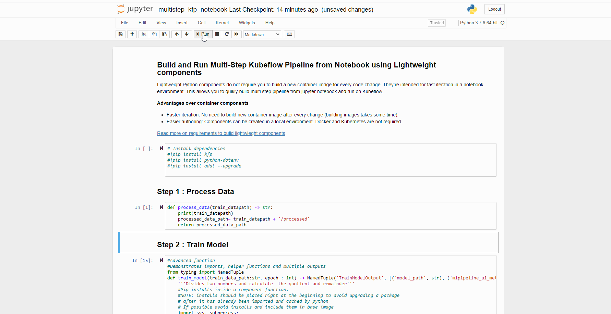
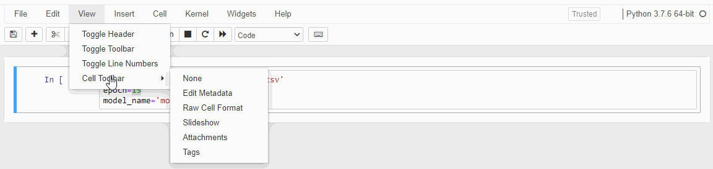

# Local Dev Experience with Kubeflow

Kubeflow pipelines offer a high level of composability which means individual components within the Kubeflow pipelines can be independently
developed and tested before assembling them into the workflow. Each component takes one or more inputs and may produce one or more outputs.<BR>
A [component](https://www.kubeflow.org/docs/pipelines/overview/concepts/component/) consists of an interface (inputs/outputs), the implementation (a Docker container image and command-line arguments) and metadata (name, description).<BR>

- [Best practices to write Components](https://www.kubeflow.org/docs/pipelines/sdk/best-practices/)
- [Create Reusable Components](https://www.kubeflow.org/docs/pipelines/sdk/component-development/)

## Running Kubeflow locally

There are multiple ways to deploy and run Kubeflow locally on your workstation. Deploying and running Kubeflow locally on your workstation is very handy in the below scenarios.

- Quickly get started with Kubeflow without investing in a deeper understanding of Kubernetes
- Certain configuration which cannot be achieved on prod Kubeflow cluster
- A hybrid setup where the data science team wants to verify components on local setup due to some restrictions before submitting to an online cluster
- The easier handoff from Data science team to DevOps team

Follow this [guide](https://ubuntu.com/tutorials/deploy-kubeflow-ubuntu-windows-mac#1-overview) for an easy way to deploy Kubeflow using MicroK8s, a lightweight version of Kubernetes, in a few simple steps.

## Experimentation with Notebooks

The majority of Data Science experimentation begins within the Notebooks and the most common challenge we come across is transforming notebooks into production-ready scripts that can be embedded into Kubeflow components. Notebooks are fast and interactive; really expedites the experimentation phase but when it comes to production; scripts are testable, reviewable, reproducible, and version controlled.

Kubeflow allows hosting your own Notebook Server which is well integrated with other components within Kubeflow. Read more [setting up Notebook Server](https://www.kubeflow.org/docs/notebooks/). If you use Jupyter lab you can try out extensions like [Kale](https://github.com/kubeflow-kale/kale) to transform your notebook into Kubeflow pipeline

However, this repo demonstrates few approaches with Notebooks

## Build and Run Multi-Step Kubeflow Pipeline from Jupyter Notebook using Lightweight Components

Refer to [example notebook](../code/experimentation-notebooks/multistep_kfp_notebook.ipynb) to learn how to build and run Kubeflow pipeline from Jupyter Notebook using **Lightweight components**



**Lightweight Python components** do not require you to build a new container image for every code change. They’re intended for fast iteration in a notebook environment. This allows you to quickly build a multi-step pipeline from Jupyter notebook and run on Kubeflow.<BR>

**Advantages over container components**

- Faster iteration: No need to build a new container image after every change (building images takes some time). You can [Speed Up Your Dockerized Development Workflow](./docs/dev-locally-on-docker.md)
- Easier authoring: Components can be created in a local environment. Docker and Kubernetes are not required.

Read more on requirements for [building a lightweight Python component](https://www.kubeflow.org/docs/pipelines/sdk/lightweight-python-components/)

## Run Notebook as Kubeflow component

If you have a complex multiple-cell notebook, you can run Notebook as a component as well. In this approach, we are using [papermill]( https://papermill.readthedocs.io/en/latest/) to parameterize and execute a notebook.

Steps to follow

1. Parameterize your notebook by designating a cell with the tag "parameters".<br>
   
2. Copy your Notebook at [/notebook-comp/notebook/experiment.ipynb](../code/notebook-comp/notebook/experiment.ipynb)
3. Update inputs at [/notebook-comp/component.yaml](../code/notebook-comp/component.yaml) and [/notebook-comp/src/program.cs](../code/notebook-comp/src/program.py) in execute_notebook method
4. Build and push container image with [/notebook-comp/build.sh](../code/notebook-comp/build.sh)
5. Run [pipeline-local.py](../code/pipeline-local.py) to build, upload and run Kubeflow pipeline

Note: Update .env file with values reflecting your configuration.

## Transforming Notebooks to Kubeflow Component

After experimentation with Notebook has succeeded, you might want to transform experimentation notebook into scripts to [design and build reusable components](https://www.kubeflow.org/docs/pipelines/sdk/component-development/).
Transforming notebooks to a production-ready script is a real challenge because of the availability of so many tools and the lack of best practice guidance. However, this can be simplified to some extent if you follow modular coding best practices from the beginning to avoid most of the refactoring that’s required during transformation

Few approaches for transforming notebooks to scripts

- Use %%writefile program.py override program.py within the Component/src/
- For complex notebook, you can tag the notebooks cells which you would like to exclude and transform with [nbcovert]( https://pypi.org/project/nbconvert/)

For example, cells with tags “note” will be excluded from the conversion.

```
jupyter nbconvert nbconvert --log-level='DEBUG' --to python --TagRemovePreprocessor.remove_cell_tags='{"note"}' experiment.ipynb --TagRemovePreprocessor.enabled=True  --clear-output
```
