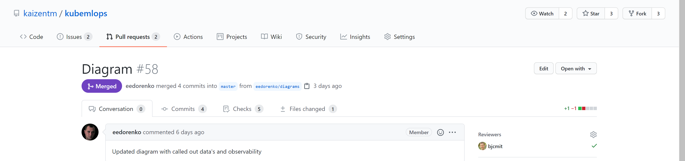
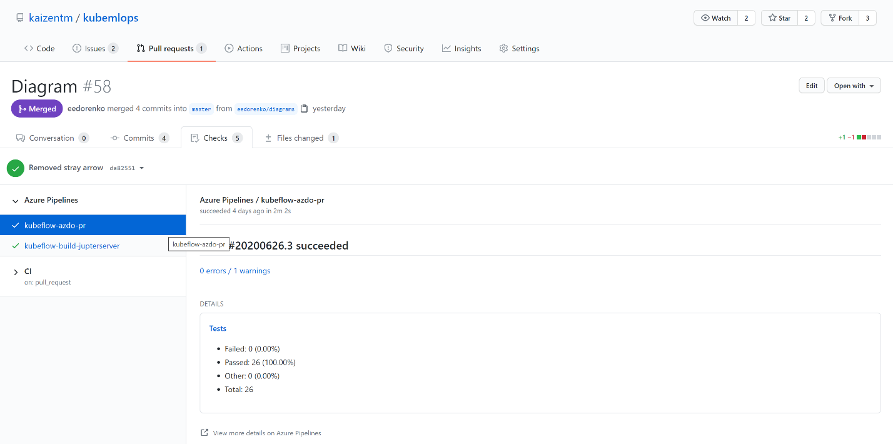
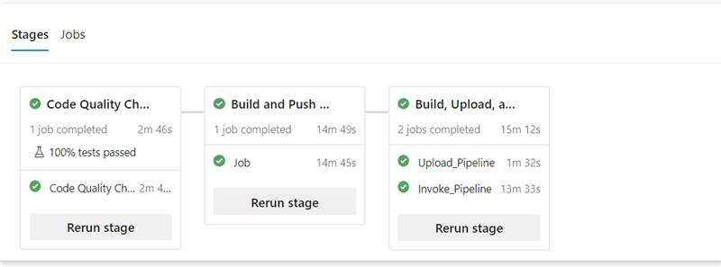
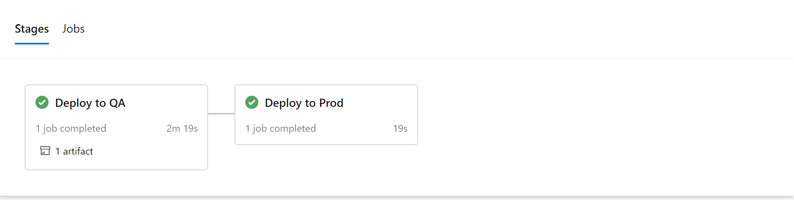

# MLOps with Azure DevOps

| Pipeline     | Status                                                                                                                                                                                                                                                                  |
| ------------ | ----------------------------------------------------------------------------------------------------------------------------------------------------------------------------------------------------------------------------------------------------------------------- |
| PR |     |
| CI      |  |
| CD      |  |

## Pull Request(PR)

In the kaizentm/kubemlops repository, when a pull request is created, the PR Azure pipeline is triggered along with a pipeline that builds the Jupyter server. The PR Azure pipeline contains only a code quality step, which performs linting. This pipeline's YAML, `pr.yaml`, can be found in the `.azdo` directory of this repository.

### Trigger PR Pipeline

1. Make a non-breaking change to a file in the kaizentm/kubemlops repository.
2. Commit the change via Git
3. Create a pull request via Git

### Access PR Azure Pipeline

After creating the pull request, you can find your PR Azure Pipeline.

1. Clicking on `Pull request` tab at the top and your PR, you will find your pull request. 

2. Clicking `Checks`, and `Azure Pipelines` on the left side, you will find your Azure pipelines. 

## Continious Integration(CI)

In the kaizentm/kubemlops repository, the CI Azure pipeline is triggered by a completed pull request that contains a change to the code directory. The CI Azure pipeline is a multi-stage pipeline containing the following stages:

- Linting
- Build and Push of Kubeflow(KF)
  - Build and Push MLFlow project
  - Build and Push Azure DevOps Callback image
  - Build and Push Preprocess image
  - Build and Push Register Artifacts image
  - Build and Push Register MLFlow image
  - Build and Push Register image
  - Build and Push Training image
  - Build and Push Databricks image
- Build, Upload, and Run Kubeflow Pipeline(KFP)
  - Install KF SDK
  - Compile Azure DevOps Pipelines
  - Upload Pipeline to KF
  - Create an Experiment with New KFP
  - Set Variables for Invoking KFP
  - Invoke KFP

The pipeline's YAML, `ci.yaml`, can be found in the `.azdo` directory of this repository. For more information about the tasks used in the YAML file, refer to [Kubeflow Pipeline Azure DevOps Tasks](https://github.com/kaizentm/kubeflow-pipeline-azdo-task).

### Trigger CI/Training Pipeline

Complete an approved pull request which contains a change to the code directory.

### Access KFP via Kubeflow Central dashboard

Go to the Access KFP via Kubeflow Central dashboard section of [MLOps with GitHub-CI/Pull Request](./mlops-github.md)

### Access registered model in MLFlow

Go to the Access registered model in MLFlow section of [MLOps with GitHub-CI/Pull Request](./mlops-github.md)

## Continious Deployment(CD)

In the kaizentm/kubemlops repository, the CD Azure pipeline is currently manually triggered. It is a multi-stage pipeline with the following stages:

- Deploy to QA
- Deploy to PROD

This pipeline's YAML, `cd.yaml`, is not currently in the `.azdo` directory, but will be there at a future date.

### Test deployed model

Go to the Test deployed model section of [MLOps with GitHub-CD/Seldon](./mlops-github.md)