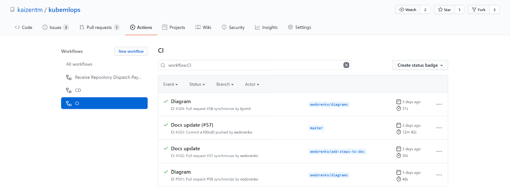
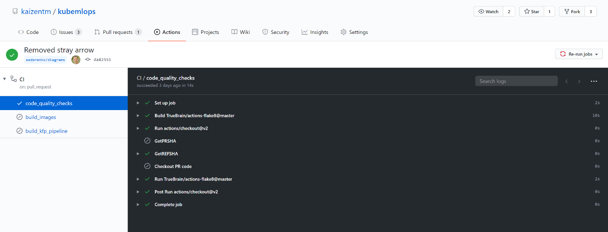
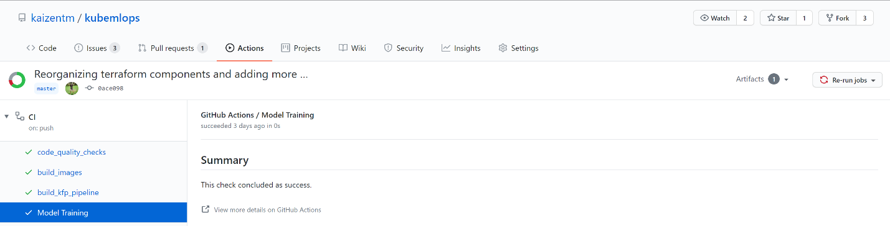
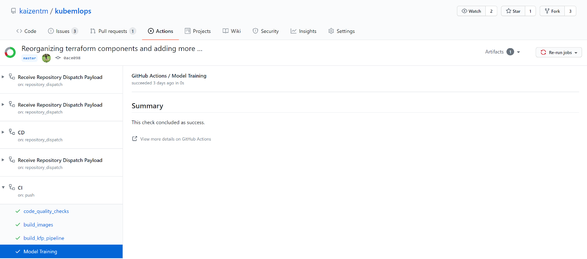

# MLOps with GitHub

## CI/Pull Request

In the kaizentm/kubemlops repository, when a pull request is created, the CI pipeline is triggered, but only the code_quality_check job is run by default. If either the build_images or build_pipeline job is necessary, then the PR must contain the comment “/build-images” or ‘/build-pipeline’.

### Trigger CI/PR Pipeline

1. Make a non-breaking change to a file in the kaizentm/kubemlops repository.
2. Commit the change via Git
3. Create a pull request via Git

### Access your pull request via GitHub

After creating the pull request, you can find your pull request in Git Hub Actions

1. Clicking on `Actions` tab at the top and `CI` on the left side, you will find your pull request. 
2. Clicking on your pull request, you will get more details on failed, finished, and skipped jobs. Clicking on the job will get you more details on failed, finished, and skipped steps.

## CI/Training

In the kaizentm/kubemlops repository when a pull request is completed and merged to master, the CI pipeline is triggered, and all jobs are run.

### Trigger CI/Training Pipeline

Merge an approved pull request to master

### Access CI pipeline via GitHub

Clicking on `Actions` tab at the top, `CI` on the left side, your pull request, and the job, you will get details on failed, finished, and skipped steps.


### Access KFP via Kubeflow Central Dashboard

1. Go to http://{KUBEFLOW_HOST}/_/pipeline/
2. Clicking on the pipeline with the matching RUN_ID, you will get details on failed and finished steps.
and the job, you will get details on failed, finished, and skipped steps.

 
### Access registered model in MLFlow

1. Go to http://{KUBEFLOW_HOST}/_/pipeline/#/runs
2. Clicking the Run name with the Pipeline Version that contains the matching RUN_ID, `register-to-aml`, and `Logs`, you will get execution logs for pipeline steps, which shows the run_id.
3. Go to http://{MLFLOW_HOST}/mlflow/#/models/tacosandburritos
4. Clicking on the model version registered at the closest time to the execution of the KFP, you will get details about the Source Run.
5. Clicking on the Source Run, you will get the external_run_id, which should match the run_id in the register_to_aml pipeline step log. If it does not, try the next registered version of the model. We will add a link between the KFP and the registered model at a future date.

## CD/Seldon

In the kaizentm/kubemlops repository when a model is deployed, which is performed every time a model is successfully registered, the CD pipeline is triggered, and all jobs are run, which deploy to the following environments:

- QA
- UAT
- PROD

### Access CD pipeline via GitHub

1. Clicking on your pull request commit in GitHub actions, you will get the CI/Training pipeline steps. 
2. Clicking on `Model Training` on the left side and then `View more details`, you get all the GitHub actions associated with your pull request. 
3. Clicking on `CD` on the left side, you get the details on failed and finished steps.

### Test deployed model

Once the CD pipeline has finished successfully, you can visit the Azure portal to find your deployment URL. Go to your ML workspace dashboard and launch Azure Machine Learning studio by selecting `Launch now`. Click `Endpoints` on the left menu and choose the latest created real-time endpoint. The Scoring URI is under `REST endpoint`.

- Test with an image of a burrito:

```bash
curl -H "Content-Type: application/json" -d '{"image":"https://www.exploreveg.org/files/2015/05/sofritas-burrito.jpeg"}' {Scoring_URI}
```

- Test with an image of a taco:

```bash
curl -H "Content-Type: application/json" -d '{"image":"https://www.inspiredtaste.net/wp-content/uploads/2018/03/Easy-Ground-Pork-Tacos-Recipe-3-1200.jpg"}' {Scoring_URI}