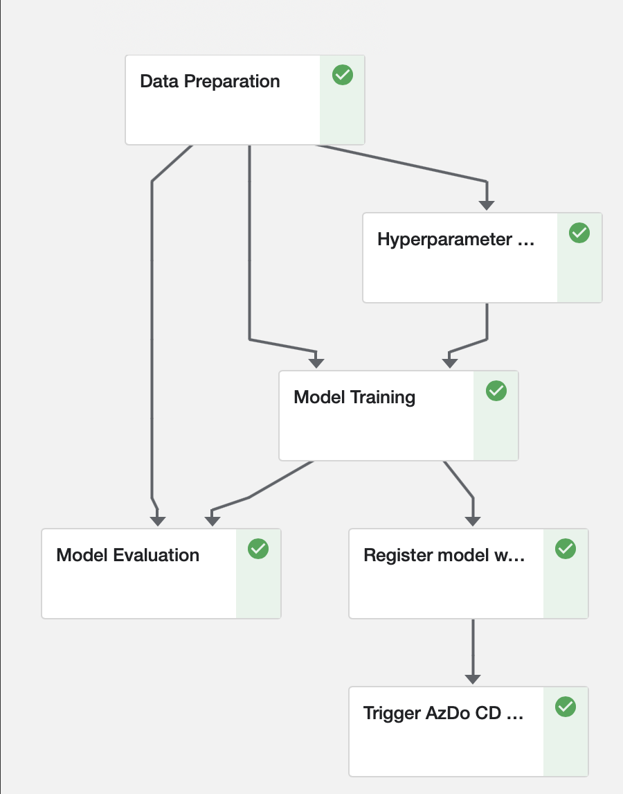
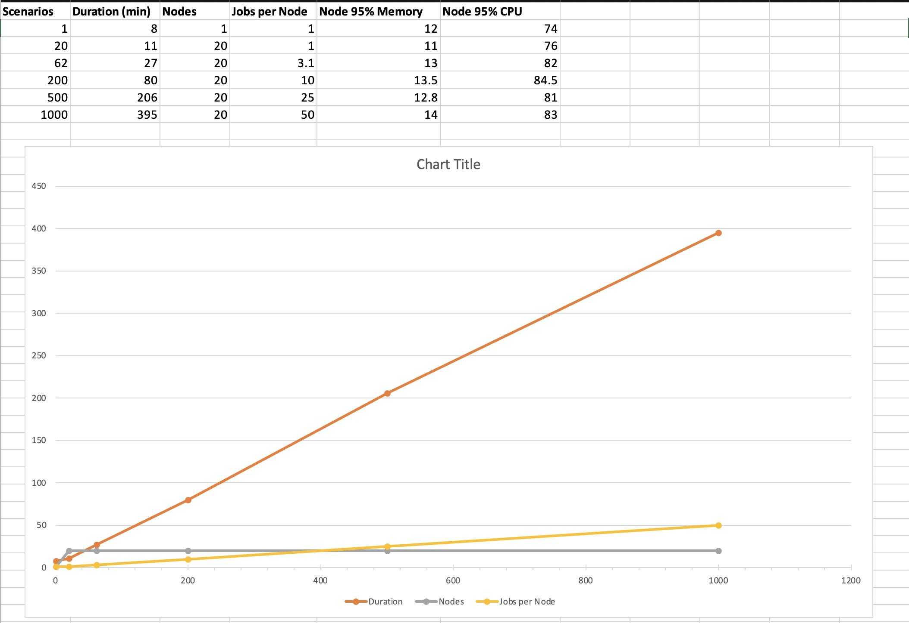

## Kubeflow Pipelines Performance Testing Report

This report is based on a real life performance testing and scalability tuning workshop.

### Pipeline

The Kubeflow pipeline used in this testing workshop was training a LightGMB prediction model and consisted of the following standard steps:

### Orchestration

* The testing was performed on a set of 6 different datasets representing different real scenarios. The size of the datasets varied from 170MB to 1.5GB. 
* In order to run N training pipelines in parallel an orchestrating pipeline was used. It read the csv file with N testing scenarios and started a Kubeflow pipeline run for each of them. 
* The CSV file contained an autogenerated list of testing scenarios pointing to 6 different datasets in the round-robin fashion.

### Resource usage configurations

As the result of iterative measuring of the required resources by each pipeline step, the following configuration have been applied:

Step                 |Memory Limit|CPU Limit|Memory Request|CPU Request
---------------------|------------|---------|--------------|-----------
Data Preparation     | 24G        | 4       | 24G          | 3
Hyperparameter Tuning| 48G        | 16      | 8G           | 12
Model Training       | 48G        | 16      | 8G           | 12
Model Evaluation     | 48G        | 16      | 8G           | 14
Register Model       | 100Mi      | -       | -            | -
Trigger AzDo CD      | 100mi      | -       | -            | -

### K8s node pools configuration

AKS cluster (K8s v1.16.9) was configured with the following node pools

Pool        |Node Size                     |Node count range|Autoscaling profile
------------|------------------------------|----------------|------
agentpool   |Standard_E8s_v3 (8 cpu x 64G) | 2              | - 
trainingpool|Standard_DS5_v2 (16 cpu x 56G)| 1-20           | [Default](https://docs.microsoft.com/en-us/azure/aks/cluster-autoscaler#using-the-autoscaler-profile)

### Jobs per Node

Hyperparameter Tuning, Model Training, Model Evaluation in total took ~80% of the whole pipeline execution time. These steps requested 12-14 CPUs. A node in the training pool was limited with 16 CPUs, so one node was supposed to run no more than one pipeline in parallel.

### Test results

The following diagram demonstrates almost linear scalability for the increased load from 1 pipeline to 1000:

